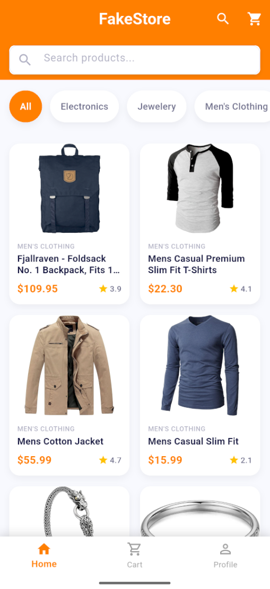
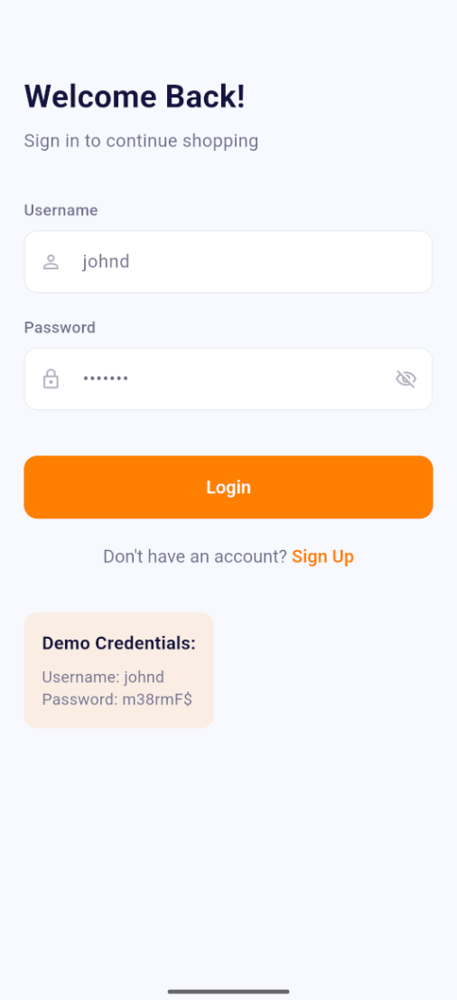
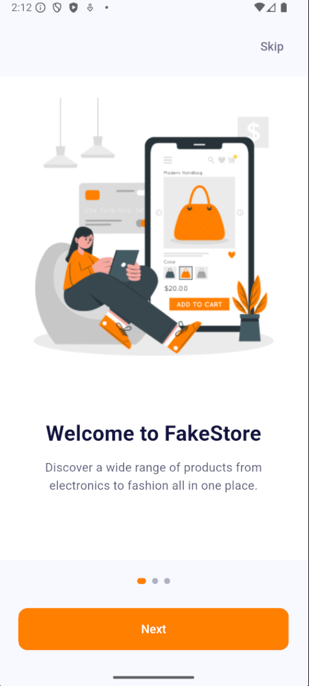
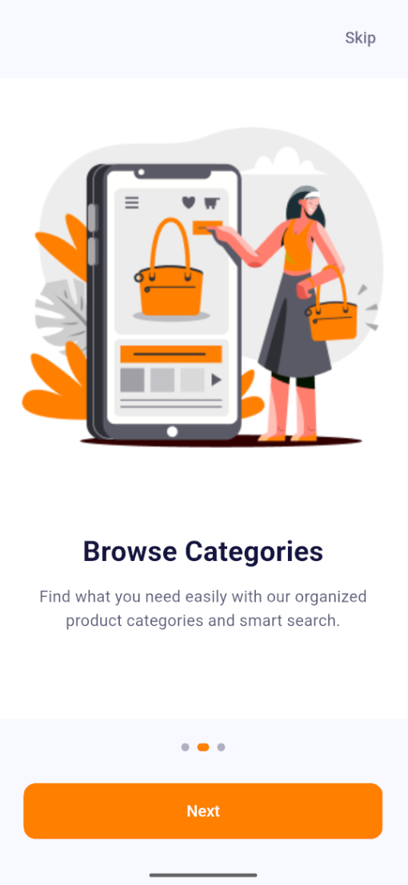
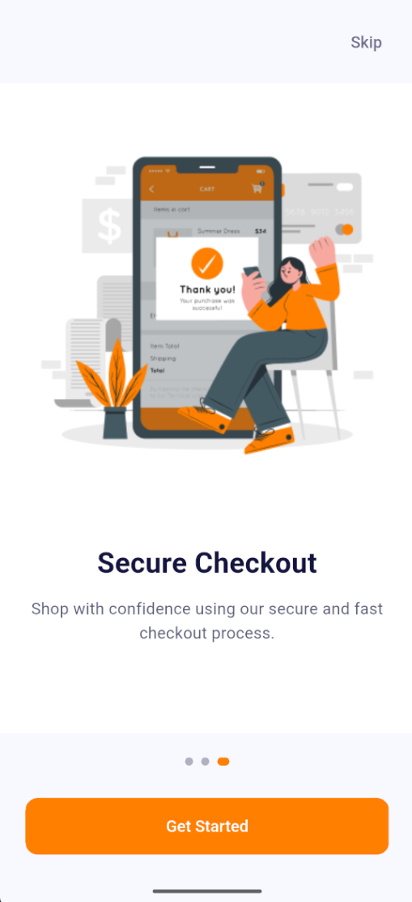
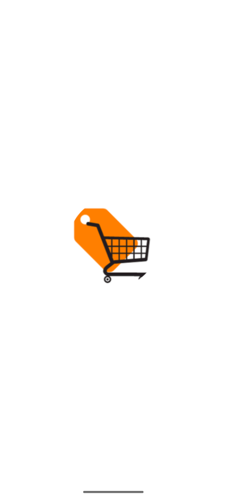
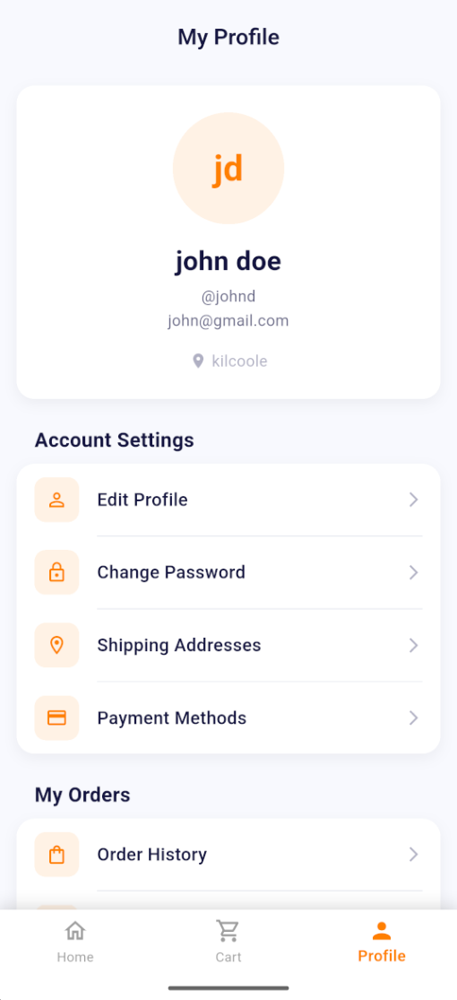
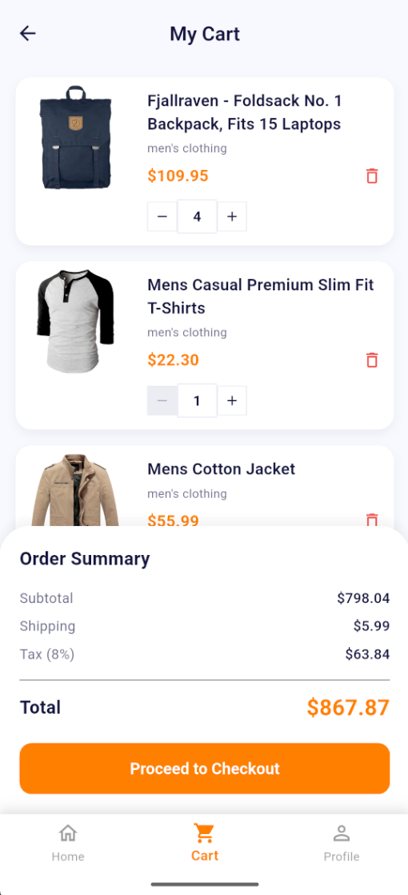

# FakeStore E-Commerce App

A modern Flutter e-commerce application that connects to the FakeStoreAPI to provide a complete shopping experience. This mobile app is built using the BLoC pattern, clean architecture principles, and follows best practices for modern mobile development.

## 📱 Screenshots

FakeStore E-Commerce App
A modern Flutter e-commerce application that connects to the FakeStoreAPI to provide a complete shopping experience. This mobile app is built using the BLoC pattern, clean architecture principles, and follows best practices for modern mobile development.
📱 Screenshots

<div style="display: flex; flex-wrap: wrap; gap: 16px; justify-content: center">
Flow Aplikasi
  <div style="flex: 1 1 30%; text-align: center">
    
    <p><strong>Home Screen</strong><br/>Tampilan beranda aplikasi</p>
  </div>
  <div style="flex: 1 1 30%; text-align: center">
    
    <p><strong>Login Screen</strong><br/>Halaman masuk pengguna</p>
  </div>
  <div style="flex: 1 1 30%; text-align: center">
    
    <p><strong>Signup Screen</strong><br/>Form pendaftaran akun baru</p>
  </div>
Onboarding
  <div style="flex: 1 1 30%; text-align: center">
    
    <p><strong>Onboarding 1</strong><br/>Tutorial penggunaan awal</p>
  </div>
  <div style="flex: 1 1 30%; text-align: center">
    
    <p><strong>Onboarding 2</strong><br/>Fitur unggulan aplikasi</p>
  </div>
  <div style="flex: 1 1 30%; text-align: center">
    
    <p><strong>Onboarding 3</strong><br/>Personalisasi preferensi</p>
  </div>
Lainnya
  <div style="flex: 1 1 30%; text-align: center">
    
    <p><strong>Splash Screen</strong><br/>Tampilan pembuka aplikasi</p>
  </div>
  <div style="flex: 1 1 30%; text-align: center">
    
    <p><strong>Profile Screen</strong><br/>Manajemen profil pengguna</p>
  </div>
  <div style="flex: 1 1 30%; text-align: center">
    
    <p><strong>Cart Screen</strong><br/>Keranjang belanja</p>
  </div>
</div>

## ✨ Features

### Authentication

- User registration with profile creation
- Login system with token-based authentication
- Persistent login using shared preferences
- Profile management

### Product Browsing

- Browse all products on the home screen
- Filter products by categories
- Search functionality
- View detailed product information
- Rating and review system
- Product image display

### Shopping Cart

- Add products to cart
- Update item quantities
- Remove items from cart
- View cart summary with pricing details
- Checkout process

### User Profile

- View and edit user information
- Access order history
- Manage shipping addresses
- Payment methods management
- Application preferences

### UI Features

- Elegant onboarding experience
- Smooth animations and transitions
- Clean and modern UI design
- Responsive layout for various device sizes
- Light theme with consistent color scheme
- Loading state indicators
- Error handling with user-friendly messages

## 🏗️ Architecture

The application is built with a clean architecture approach:

### Layers

- **Domain**: Contains business logic, entities, and repository interfaces
- **Data**: Implements repositories and connects to external data sources (API)
- **Presentation**: UI components, screens, and BLoC state management

### State Management

- BLoC (Business Logic Component) pattern for state management
- Event-driven architecture
- Clear separation of UI and business logic

### Dependency Injection

- GetIt for service location and dependency injection
- Lazy singleton pattern for repositories
- Factory pattern for BLoCs

## 🛠️ Technical Stack

- **Flutter**: UI framework
- **Dart**: Programming language
- **BLoC**: State management
- **HTTP**: API communication
- **SharedPreferences**: Local storage
- **GetIt**: Dependency injection

## 📡 API Integration

The app connects to the [FakeStoreAPI](https://fakestoreapi.com/) which provides:

- Product listings
- Categories
- User authentication
- Cart functionality

## 🚀 Getting Started

### Prerequisites

- Flutter SDK (version 2.5.0 or higher)
- Dart SDK (version 2.14.0 or higher)
- Android Studio / VS Code with Flutter extensions

### Installation

1. Clone the repository:

```bash
git clone https://github.com/yourusername/fakestore-app.git
```

2. Navigate to the project directory:

```bash
cd fakestore-app
```

3. Install dependencies:

```bash
flutter pub get
```

4. Run the app:

```bash
flutter run
```

## 📁 Project Structure

```
lib/
├── data/
│   ├── api/
│   │   └── api_config.dart
│   └── repositories/
│       ├── cart_repository_impl.dart
│       ├── product_repository_impl.dart
│       └── user_repository_impl.dart
├── di/
│   └── container.dart
├── domain/
│   ├── entities/
│   │   ├── cart.dart
│   │   ├── product.dart
│   │   └── user.dart
│   └── repositories/
│       ├── cart_repository.dart
│       ├── product_repository.dart
│       └── user_repository.dart
├── presentation/
│   ├── bloc/
│   │   ├── auth/
│   │   ├── cart/
│   │   └── product/
│   ├── route/
│   │   └── app_route.dart
│   ├── screens/
│   │   ├── auth_screen/
│   │   ├── cart_screen/
│   │   ├── main_screen/
│   │   ├── product_detail_screen/
│   │   ├── profile_screen/
│   │   └── splash_screen/
│   ├── themes/
│   │   ├── color.dart
│   │   └── theme_data.dart
│   └── widget/
│       ├── button.dart
│       ├── formfield.dart
│       └── [other widgets]
└── main.dart
```
